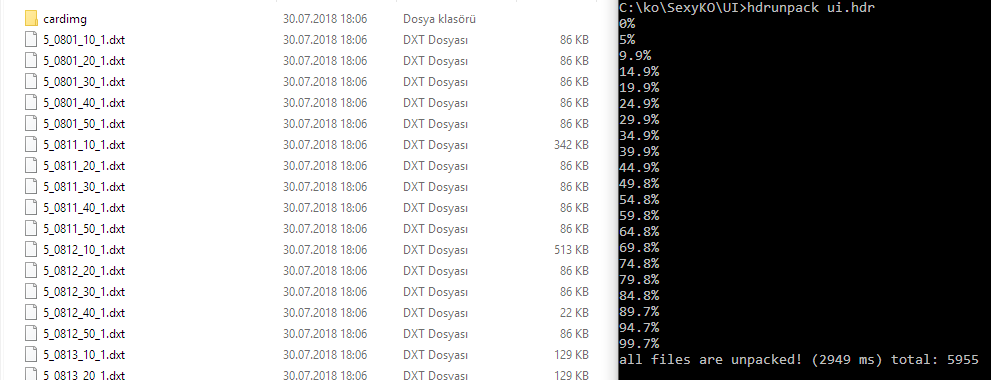

Knight Online HDR unpacker
==============================
There are hdr files in knight online installation folder. These files contain dxt files, uif files and many more. When you put a file in their folder, launcher will automaticly insert the file to xxx.hdr and xxx.src. That makes single file for all assets. This unpacker will unpack the hdr and src. It will create an output folder. 

> If you open launcher while output folder exists, launcher will insert all files to the .hdr and .src. So be carefull before opening launcher. You may accidentally increase these file's size

Install
----------------
* install node.js
* type in terminal `npm i ko-hdr-unpacker -g`

Usage
-----------------
* type in terminal `hdrunpack file.hdr`
* there will be `output` folder